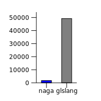
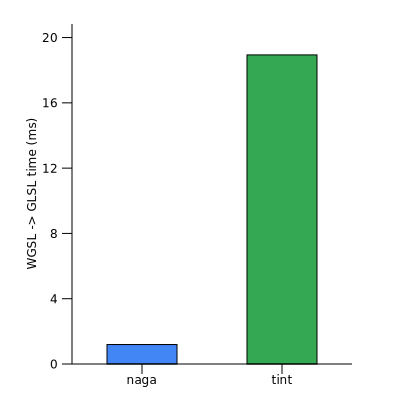
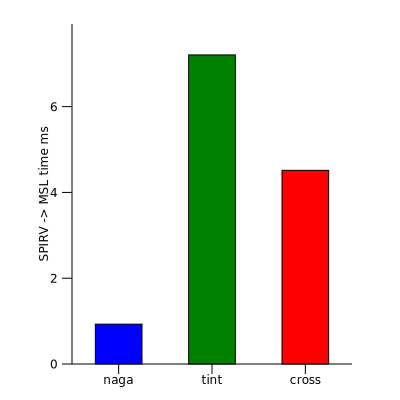

# shader-translation-benchmark
[](https://github.com/kvark/shader-translation-benchmark/actions)

Benchmarking tools for shader translators:
  - [naga](https://github.com/gfx-rs/naga)
  - [tint](https://dawn.googlesource.com/tint/)
  - [glslang](https://github.com/KhronosGroup/glslang)
  - [spirv-cross](https://github.com/KhronosGroup/SPIRV-Cross)

## Results

These are some of the conversion paths, in ms (lower is better):

SPIRV">GLSL">MSL">

## Building

On NixOS, just `nix-shell` into the current folder to pick up the included `default.nix` environment.
On other Linux systems, install packages listed in this file (see `buildInputs`).
On Windows... use Linux for development.

```bash
mkdir build
cd build
cmake .. -DCMAKE_BUILD_TYPE=RelWithDebInfo
make -j
```

## Running
```bash
build/bench
```
